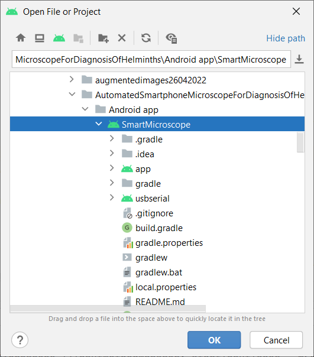

# Android app software

## Pair Raspberry Pi with phone {pagestep}

For starters you will need to make sure that the Raspberry Pi can connect to the smartphone's mobile hotspot. If you used the default SSID and password settings in the previous settings you should only need to change the smartphone's hotspot settings to match the ones that the Raspberry Pi will be expecting to connect to: 

* Network name (SSID) = microscope
* Password = smart 

Usually this can be done through settings. If you search for Mobile Hotspot in your device's search function it will usually take you to a page where you can switch the hotspot on and change the Network name/SSID and password.

You will want to check at this stage that the Raspberry Pi is connected to your mobile hotspot. Usually under the mobile hotspot settings there will be some information telling you which devices are connected. 

## Download Android Studio {pagestep}

Download and install Android Studio from the following website: [Android studio](https://developer.android.com/studio)

## Import app into android studio and install {pagestep}

Open Android Studio once it is downloaded and installed. 

If you have not yet cloned the repository, you will want to do that now using:

> git clone https://github.com/Oliverhiggins93/AutomatedSmartphoneMicroscope.git

In Android Studio, open the project by opening the File dropdown and selection Open 

You will need to open the folder entitled 'Smartmicroscope'.
 

Once this is open you should build and install the app. 

## Run app {pagestep}

You can now run the app from the phone. The most important thing to check at this stage is whether you can receive an image. By clicking on 'Open Web Camera' you should soon begin to see an image stream to your device.