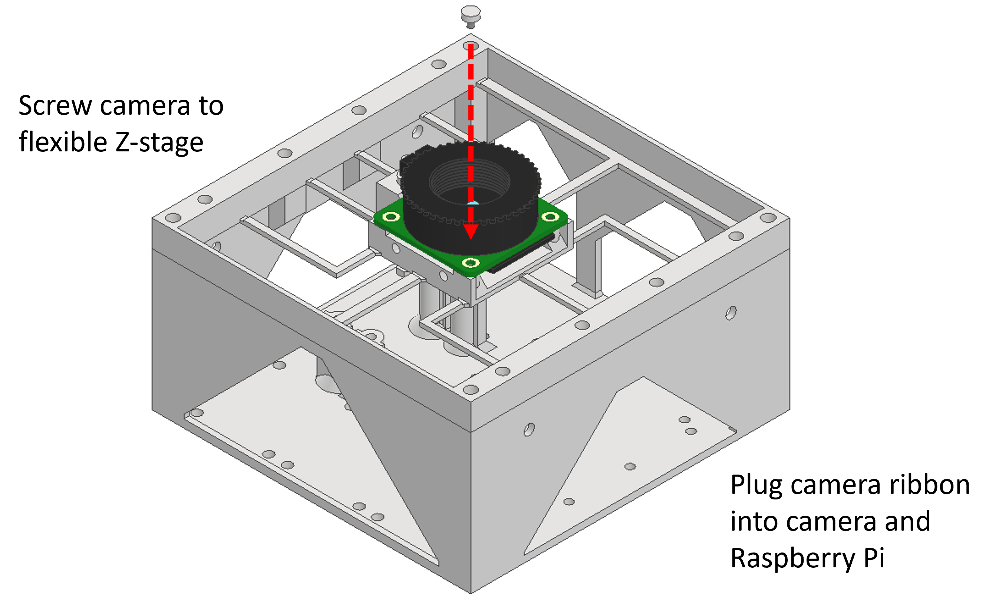
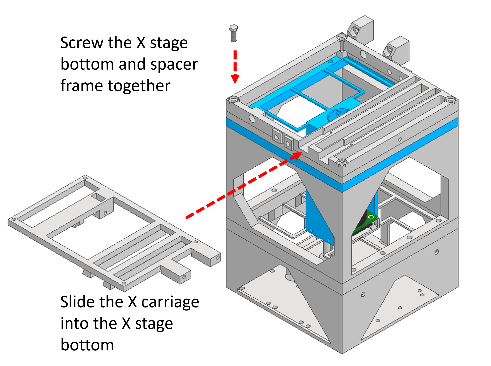
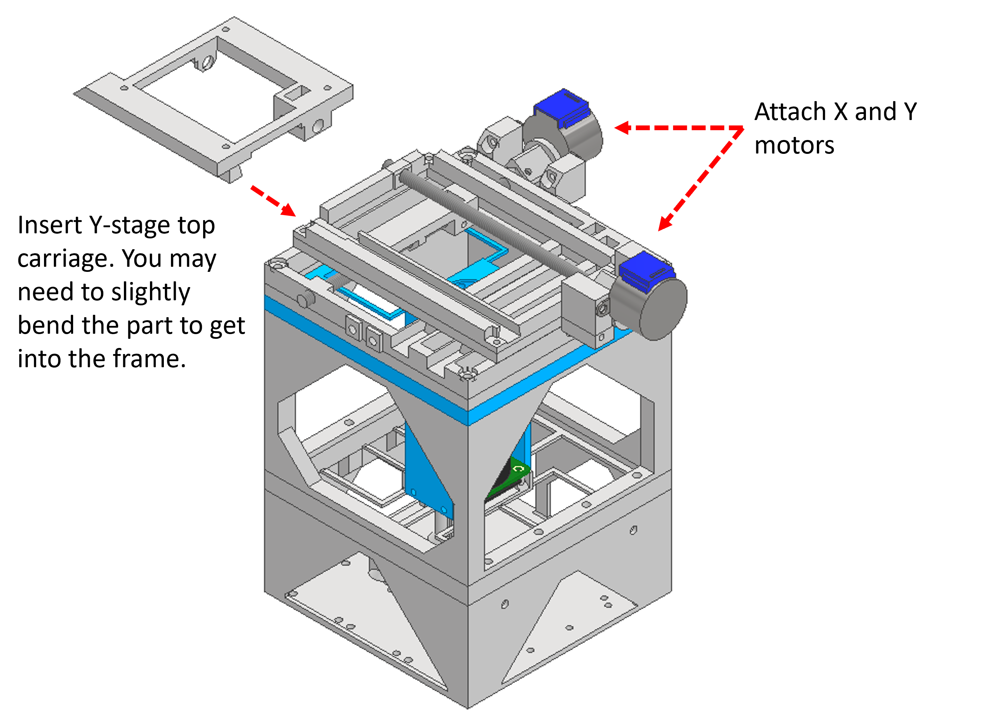

[Raspberry Pi]:Parts.yaml#RaspberyPi
[Raspberry Pi Camera]:Parts.yaml#RaspberyPiCamera
[M3 bolt]:Parts.yaml#M3x8PanSteel
[28BYJ-48]:Parts.yaml#28BYJ-48
[ULN2003]:Parts.yaml#ULN2003
[Jumper wires]:Parts.yaml#Jumperwires
[3mm bolt coupler]:Parts.yaml#Shaftcouple3mm
[6mm bolt coupler]:Parts.yaml#Shaftcouple6mm
[M3x30mm bolt]:Parts.yaml#M3x30GHexSteel
[M3x8mm bolt]:Parts.yaml#M3x8PanSteel
[M6x130mm bolt]:Parts.yaml#M6x130PanSteel
[M3 nut]:Parts.yaml#M3nut
[M6 nut]:Parts.yaml#M6nut
[M2.5x6mm bolt]:Parts.yaml#M2.5x6
[M4x10mm bolt]:Parts.yaml#M4x10PanSteel
[Condenser lens]:Parts.yaml#Plasticcondenser
[White LED]:Parts.yaml#1WLED
[resistor]:Parts.yaml#resistor
[RMS objective]:Parts.yaml#rmsobjective
[Tube lens]:Parts.yaml#tubelens

# Assembling the microscope 

## Attaching Raspberry pi and motor drivers to base {pagestep}

We will start by assembling the base of the microscope and attaching the electronic components. You will want to thread the bolts through the bottom of the base so that the threaded ends finish inside the microscopy body. 

Take the [Raspberry Pi]{Qty:1} and thread an [M3 bolt]{Qty: 4} through the hole in each corners. Secure the [Raspberry Pi] with the bolts.

Take the 3x [ULN2003]{Qty:3} motor drivers and attach these to the base in the same way with the [M3 bolt]{Qty: 12}s.

Using 2x [M3 bolt]{Qty:2} attach the [28BYJ-48]{Qty:1} by screwing bolts through the arms into the plastic holders.

## Motor and motor driver wiring {pagestep}

Attach each [28BYJ-48] header clip to the corresponding [ULN2003] motor driver.

We have had good success powering all of the motors using a simple parallel circuit from the 5V Raspberry Pi pin. Some resources online caution against this, due to concerns that the motors may drain more current than the 5V pin is rated to supply, but personally I have never found any difficulties with this, and it removes the requirement for an additional power source. 

Using [Jumper wires]{Qty: 12} attach each pin of the [ULN2003] to the [Raspberry Pi]. The pin order should be as follows:

* X axis:
    * **Motor pin 1**: Raspberry Pi pin 18
    * **Motor pin 2**: Raspberry Pi pin 23
    * **Motor pin 3**: Raspberry Pi pin 24
    * **Motor pin 4**: Raspberry Pi pin 25

* Y axis:
    * **Motor pin 1**: Raspberry Pi pin 8
    * **Motor pin 2**: Raspberry Pi pin 7
    * **Motor pin 3**: Raspberry Pi pin 12
    * **Motor pin 4**: Raspberry Pi pin 16

* Z axis:
    * **Motor pin 1**: Raspberry Pi pin 4
    * **Motor pin 2**: Raspberry Pi pin 17
    * **Motor pin 3**: Raspberry Pi pin 27
    * **Motor pin 4**: Raspberry Pi pin 22

Please note, if your motors do not move when you test them, you should try to swap motor pin 2 and 3 for each driver. 

## Attaching screw couplings to motors {pagestep}

There are three screw couples; 2x [6mm bolt coupler]{Qty:2} and 1x [3mm bolt coupler]{Qty:1} which are used to attach the [M3x30mm bolt]{Qty:1} and M6 bolts to the [28BYJ-48] motors.

To assemble the screw couplings you should first screw a spare nut all the way along the length of the screw, so that it is flush (or close to flush) with the hex head. You can then insert the hex head into the hexagonal hole in the screw coupler. The nut will help the screw to stay in place in the coupler. 

You can then push the shaft of the [28BYJ-48] into the rectangular hole of the screw coupler. 

Once these steps have been completed you should insert 2x [M3 bolt]{Qty:2} into the holes in the side to secure the bolt and shaft from moving. 

## Assembling Z stage {pagestep}

Insert an [M3 nut]{Qty: 1} into the flexible camera holder. 

## Attaching camera to Z stage {pagestep}

Using 4x [M2.5x6mm bolt]{Qty: 4} Screw the camera onto the flexible holder.

You will now need to attach the camera ribbon. One end of the camera ribbon will attach to the Raspberry Pi Zero, and the other end will attach to the camera.

## Attaching frame and Z stage to base {pagestep}

Use 4x [M4x10mm bolt]{Qty: 4} to attach the frame to the base. The bolts should screw through the four central holes in the frame, through the camera holder, and into the base. 

## Attaching objective tube to camera holder {pagestep}

Use 4x [M3x8mm bolt]{Qty: 4} to attach the objective tube to the camera holder. The bolts screw through the four holes in the bottom of the objective tube arms and into the holes in the camera holder.

## Attaching XY stage bottom to objective holder {pagestep}

Use 4x [M4x10mm bolt]{Qty: 4} to attach the X stage bottom to the objective holder.

Slide the X carriage top into the X stage bottom. This should slide directly in, but you may need to slightly bend the part to get the nut holder over the frame.

Insert an [M6 nut]{Qty: 1} into the X carriage. 

 
## Assembling Y stage {pagestep}

Use 4x [M3x8mm bolt]{Qty: 4} to attach the Y stage bottom to the X stage top.

Insert a 2x [M6x130mm bolt]{Qty: 2} into the X and Y stages through the holes in the side of the stage carriages. 

## Attaching motors Y stage {pagestep}

Use 4x [M3x8mm bolt]{Qty: 4} to attach the [28BYJ-48] motors to the stage.

Slide the Y stage top into the stage. You may need to bend the stage slightly to get the part into the frame. 

Insert a [M6 nut]{Qty: 1} into the Y carriage.

## Insert objective {pagestep}

If you are using the [Tube lens], you should insert this into the Tube lens holder. You can then use 1x [M3x8mm bolt]{Qty: 1} inserted into the side of the objective holder to hold the tube lens in place. 

Insert the [RMS objective]{Qty: 1} into the objective holder. It should fit easily in place, but can be held in place using an [M3x8mm bolt]{Qty: 1}.

## Prepare illumination arm {pagestep}

Glue the [White LED] onto the illumination frame in the central recess.

Insert the [Condenser lens]{Qty: 1} into the condenser holder.

You should prepare the circuit by soldering a 100 ohm [resistor]{Qty: 1} to 2x [Jumper wires]{Qty: 2}. The jumper wire attached to the positive terminal of the LED should be attached to the 5V pin of the Raspberry Pi. The jumper wire attached to the negative terminal of the LED should be attached to one of the ground pins of the Raspberry Pi. 

Using 2x [M3x8mm bolt]{Qty: 2}, screw the condenser holder onto the illumination frame.

## Attach illumination arm {pagestep}

Use 4x [M4x10mm bolt]{Qty: 4} to attach the illumination frame to the microscope stage.

## Congratulations! {pagestep}

Well done, you have successfully built a microscope! Continue to the next steps for information about using the software. 